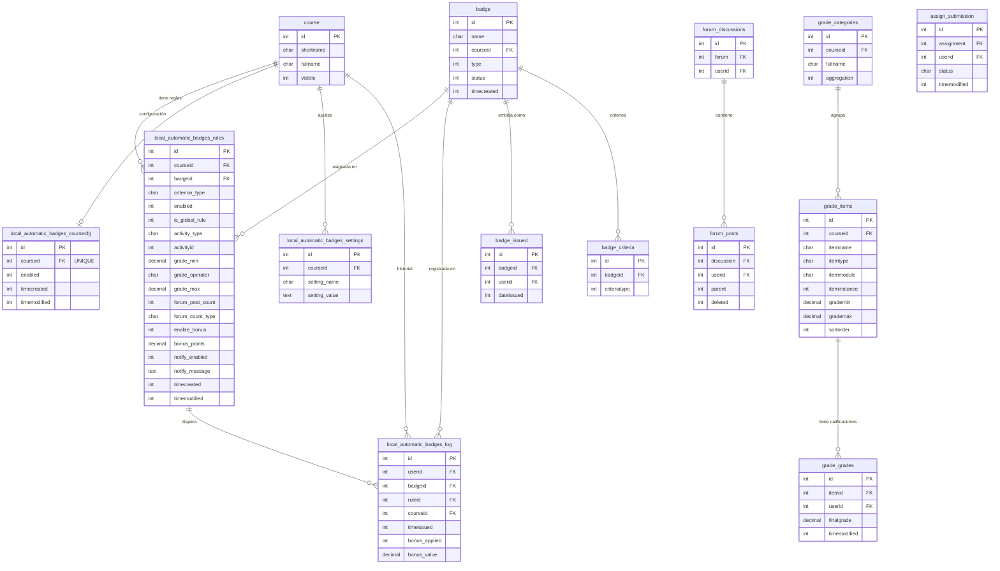

# Modelo Lógico — local_automatic_badges

> Versión del plugin: **0.6.0** · Fecha: 2026-03-24

---

## 1. Visión General

El plugin **Automatic Badges** automatiza la entrega de insignias de Moodle basándose en reglas configurables por curso. Combina tres mecanismos de disparo: eventos en tiempo real, tarea cron en lote, y evaluación manual (modo prueba).

```
┌──────────────────────────────────────────────────────────────────┐
│                        AUTOMATIC BADGES                          │
│                                                                  │
│  Entrada de datos          Lógica central         Salidas        │
│  ─────────────────         ──────────────         ───────        │
│  Formulario de regla  ──►  rule_engine        ──► badge::issue() │
│  Evento de nota       ──►  rule_manager       ──► log entry      │
│  Evento de foro       ──►  helper             ──► bonus_points   │
│  Tarea cron           ──►  bonus_manager      ──► notificación   │
│  Editor de insignia   ──►  dry_run_evaluator  ──► badge image    │
└──────────────────────────────────────────────────────────────────┘
```

---

## 2. Diagrama Entidad-Relación



---

## 3. Tablas Propias del Plugin

### 3.1 `local_automatic_badges_rules` — Reglas

Tabla principal. Cada fila define UNA regla: qué condición debe cumplirse, en qué actividad/ítem, y qué insignia otorgar.

| Campo | Tipo | Nulo | Por defecto | Descripción |
|---|---|---|---|---|
| `id` | INT | NO | — | PK autoincrement |
| `courseid` | INT | NO | — | FK → course.id |
| `badgeid` | INT | NO | — | FK → badge.id |
| `criterion_type` | CHAR(50) | NO | — | `grade` · `forum_grade` · `grade_item` · `forum` · `submission` · `section` |
| `enabled` | INT(1) | NO | `1` | 1 = activa, 0 = deshabilitada |
| `is_global_rule` | INT(1) | NO | `0` | 1 = aplica a todas las actividades del tipo |
| `activity_type` | CHAR(50) | SÍ | NULL | Tipo de módulo para reglas globales (quiz, assign…) |
| `activityid` | INT | SÍ | NULL | cmid de la actividad **o** grade_item.id si criterion=`grade_item` |
| `grade_min` | DECIMAL(10,2) | SÍ | NULL | Umbral mínimo (porcentaje 0–100) |
| `grade_operator` | CHAR(5) | NO | `>=` | Operador: `>=` `>` `==` `range` |
| `grade_max` | DECIMAL(10,2) | SÍ | NULL | Límite superior para operador `range` |
| `forum_post_count` | INT | SÍ | NULL | Publicaciones requeridas |
| `forum_count_type` | CHAR(20) | SÍ | `all` | `all` · `replies` · `topics` |
| `require_submitted` | INT(1) | SÍ | NULL | Entrega requerida (criterion=`submission`) |
| `require_graded` | INT(1) | SÍ | NULL | Calificación publicada requerida |
| `submission_type` | CHAR(20) | SÍ | NULL | `any` · `ontime` · `early` |
| `early_hours` | INT | SÍ | NULL | Horas antes del plazo para entrega anticipada |
| `section_min_grade` | DECIMAL(10,2) | SÍ | NULL | Promedio mínimo para criterion=`section` |
| `enable_bonus` | INT(1) | NO | `0` | 1 = aplicar puntos extra |
| `bonus_points` | DECIMAL(10,2) | SÍ | NULL | Puntos a añadir al libro de calificaciones |
| `notify_enabled` | INT(1) | NO | `0` | 1 = enviar notificación |
| `notify_message` | TEXT | SÍ | NULL | Mensaje personalizado |
| `timecreated` | INT | NO | — | Timestamp Unix de creación |
| `timemodified` | INT | NO | — | Timestamp Unix de última modificación |

**Índices:** `courseid`, `badgeid`

---

### 3.2 `local_automatic_badges_log` — Historial

Registro inmutable de cada insignia otorgada por el plugin.

| Campo | Tipo | Descripción |
|---|---|---|
| `id` | INT PK | Autoincrement |
| `userid` | INT | Usuario que recibió la insignia |
| `badgeid` | INT | Insignia otorgada |
| `ruleid` | INT | Regla que disparó el otorgamiento |
| `courseid` | INT | Contexto de curso |
| `timeissued` | INT | Timestamp del otorgamiento |
| `bonus_applied` | INT(1) | 1 si se aplicaron puntos extra |
| `bonus_value` | DECIMAL(10,2) | Valor del bono aplicado |

**Índices:** `userid`, `badgeid`, `ruleid`

---

### 3.3 `local_automatic_badges_settings` — Ajustes por Curso

Pares clave-valor para configuración por curso.

| Campo | Descripción |
|---|---|
| `courseid` | Curso al que aplica |
| `setting_name` | Nombre del ajuste (p. ej. `default_notify_message`) |
| `setting_value` | Valor del ajuste |

---

### 3.4 `local_automatic_badges_coursecfg` — Habilitación por Curso

Un registro por curso. Controla si el plugin está activo en ese curso.

| Campo | Descripción |
|---|---|
| `courseid` | UNIQUE FK → course.id |
| `enabled` | 1 = activo, 0 = inactivo |

---

## 4. Tablas Core de Moodle Utilizadas

| Tabla | Acceso | Propósito |
|---|---|---|
| `badge` | R/W | Crear, clonar y activar insignias |
| `badge_issued` | R | Verificar si usuario ya tiene la insignia |
| `badge_criteria` | W | Crear criterios al diseñar insignia |
| `badge_criteria_param` | W | Parámetros del criterio (roles) |
| `grade_items` | R | Obtener escala (grademin/max) y lista de ítems |
| `grade_grades` | R | Leer calificación final del usuario |
| `grade_categories` | R/W | Leer categorías; crear categoría de bonificaciones |
| `forum_posts` | R | Contar publicaciones del usuario |
| `forum_discussions` | R | Filtrar por foro específico |
| `assign_submission` | R | Verificar estado de entrega |
| `course` | R | Iterar cursos activos |
| `user` | R | Datos del estudiante |
| `role` · `role_assignments` · `context` | R | Identificar estudiantes por rol |

---

## 5. Arquitectura de Clases

```
namespace local_automatic_badges
│
├── rule_engine          ← Evaluación de criterios (stateless, solo static)
│     Entradas: $rule (stdClass), $userid
│     Salida:   bool (cumple / no cumple)
│
├── rule_manager         ← CRUD de reglas + ciclo de vida de insignia
│     Entradas: form data, courseid
│     Salidas:  ruleid, notificaciones, resultados de generación global
│
├── helper               ← Utilidades de consulta (actividades, estudiantes, ítems)
│
├── bonus_manager        ← Escritura de puntos extra en libro de calificaciones
│
├── observer             ← Listeners de eventos en tiempo real
│     grade_updated  →  dispara evaluación de reglas tipo grade/forum_grade
│     post_created   →  dispara evaluación de reglas tipo forum
│
├── dry_run_evaluator    ← Simulación sin otorgar insignias + render HTML
│
├── hook_callbacks       ← Inyección de UI en páginas de Moodle core
│
└── task/
      award_badges_task  ← Tarea cron: evaluación masiva de todos los cursos
```

---

## 6. Flujos de Datos

### 6.1 Otorgamiento en Tiempo Real (evento de nota)

```
[Moodle core guarda calificación]
        │
        ▼  core\event\grade_updated
observer::grade_updated()
        │
        ├─ helper::is_enabled_course()  ──► false → salir
        │
        ├─ Obtener reglas activas del curso (criterion_type: grade / forum_grade)
        │
        └─ Para cada regla:
                │
                ├─ rule_engine::check_rule($rule, $userid)
                │       │
                │       └─ get_grade_for_cmid()
                │               └─ grade_get_grades() → normalizar a %
                │
                ├─ badge_issued? → sí: omitir
                │
                ├─ badge::issue($userid) ─────────────────► badge_issued
                ├─ INSERT local_automatic_badges_log ──────► historial
                └─ bonus_manager::apply_bonus() ───────────► grade_grades
```

### 6.2 Otorgamiento en Lote (tarea cron)

```
award_badges_task::execute()
        │
        ├─ SELECT DISTINCT courseid FROM rules WHERE enabled=1
        │
        └─ Para cada curso:
                │
                ├─ is_enabled_course() → false: omitir
                ├─ get_students_in_course() → lista de userids
                ├─ GET reglas habilitadas del curso
                │
                └─ Para cada (estudiante × regla):
                        │
                        ├─ rule_engine::check_rule()
                        │     ├─ grade       → get_grade_for_cmid()
                        │     ├─ grade_item  → grade_items + grade_grades directo
                        │     ├─ forum       → COUNT(forum_posts)
                        │     ├─ submission  → assign_submission.status
                        │     └─ section     → promedio de actividades en sección
                        │
                        ├─ ¿Ya tiene insignia? → sí: omitir
                        ├─ badge::issue()
                        ├─ INSERT log
                        └─ apply_bonus() si aplica
```

### 6.3 Creación de Regla Global

```
Formulario global rule
        │
rule_manager::generate_global_rules()
        │
        ├─ get_fast_modinfo() → CMs del tipo seleccionado
        │
        └─ Para cada actividad:
                ├─ helper::clone_badge(baseBadgeId) → nuevo badge con imagen
                ├─ build_rule_record() con activityid = cmid
                ├─ save_rule() → INSERT rules
                └─ activate_badge_if_needed()
```

### 6.4 Diseñador de Insignias → Moodle

```
Usuario diseña en Fabric.js canvas
        │
        ├─ canvas.toDataURL('png', multiplier:2) → base64
        │
POST ajax/save_badge_design.php
        │
        ├─ base64_decode() + validar tipo imagen
        ├─ INSERT badge (status=INACTIVE)
        ├─ badges_process_badge_image() → recorte + thumbnails
        ├─ INSERT badge_criteria (OVERALL + MANUAL)
        ├─ badge::set_status(ACTIVE)
        └─ return { success, badgeid }
```

---

## 7. Jerarquía de Habilitación

Para que una insignia sea otorgada, **las tres capas** deben estar activas:

```
Nivel 1: Plugin global
    local_automatic_badges_coursecfg.enabled = 1
              │
              ▼
Nivel 2: Campo personalizado de curso
    helper::is_enabled_course() → custom_field 'automatic_badges_enabled'
              │
              ▼
Nivel 3: Regla individual
    local_automatic_badges_rules.enabled = 1
              │
              ▼
         Evaluación y otorgamiento
```

---

## 8. Normalización de Calificaciones

Todas las calificaciones se convierten a **porcentaje (0–100)** antes de comparar:

```
porcentaje = ((nota_raw − grademin) / (grademax − grademin)) × 100
```

Esto permite definir reglas con umbrales uniformes independientemente de si la actividad puntúa sobre 5, 10, 20 ó 100.

---

## 9. Sistema de Bonificaciones

Cuando `enable_bonus = 1` y la insignia es otorgada:

```
bonus_manager::apply_bonus()
        │
        ├─ ensure_bonus_category()
        │       └─ grade_categories: "Bonificaciones (Auto Badges)"
        │               (se crea solo si no existe)
        │
        ├─ ensure_bonus_grade_item()
        │       └─ grade_items:
        │               itemtype  = 'manual'
        │               idnumber  = 'auto_badges_bonus_r{ruleid}'
        │               categoryid → bonus_category.id
        │
        └─ grade_item::update_final_grade(userid, bonus_points)
                └─ grade_grades: finalgrade += bonus_points
```

> Los puntos se aplican **una sola vez** por estudiante. No inflan la nota máxima del curso.

---

## 10. Tipos de Criterio

| Criterio | Tabla evaluada | Campo clave | Normalización |
|---|---|---|---|
| `grade` | `grade_grades` vía cmid | `finalgrade` | Sí (% sobre grademax) |
| `forum_grade` | `grade_grades` vía cmid foro | `finalgrade` | Sí |
| `grade_item` | `grade_grades` directo por itemid | `finalgrade` | Sí |
| `forum` | `forum_posts` + `forum_discussions` | `COUNT(p.id)` | No (conteo absoluto) |
| `submission` | `assign_submission` | `status` + tiempo | No |
| `section` | promedio de actividades de la sección | múltiples | Sí |

---

## 11. Puntos de Entrada (UI)

| URL | Propósito |
|---|---|
| `/local/automatic_badges/course_settings.php?id=X` | Hub principal del curso (pestañas: Reglas · Insignias · Historial · Ajustes) |
| `/local/automatic_badges/add_rule.php?id=X` | Crear regla individual |
| `/local/automatic_badges/edit_rule.php?id=X&ruleid=Y` | Editar regla existente |
| `/local/automatic_badges/add_global_rule.php?id=X` | Crear regla global (multi-actividad) |
| `/local/automatic_badges/pages/badge_designer.php?id=X` | Editor visual de insignias (canvas Fabric.js) |
| `/local/automatic_badges/export.php?id=X` | Exportar historial a CSV/Excel |

---

## 12. Endpoints AJAX

| Archivo | Parámetros entrada | Respuesta |
|---|---|---|
| `ajax/load_activities.php` | `courseid`, `criterion_type`, `modname` | JSON array · HTML `<select>` |
| `ajax/save_badge_design.php` | `courseid`, `name`, `imagedata` (base64) | `{success, badgeid, message}` |

---

## 13. Funciones y Responsabilidades por Módulo

Esta sección documenta cada clase del plugin con sus métodos, firmas y responsabilidad individual.

> **Convenciones:** `🔒 private` · `🔓 public` · `⚡ static` · `📌 instance`

---

### 13.1 `rule_engine` — Motor de Evaluación

**Archivo:** `classes/rule_engine.php`
**Responsabilidad:** Evalúa si un usuario cumple una regla. Es la única clase que lee calificaciones y participación para tomar la decisión booleana. No escribe en base de datos.

| Visib. | Firma | Retorno | Descripción |
|---|---|---|---|
| 🔓⚡ | `check_rule(stdClass $rule, int $userid)` | `bool` | Punto de entrada principal. Despacha al evaluador correcto según `criterion_type`. Retorna `false` si la regla está deshabilitada. |
| 🔒⚡ | `check_global_rule(stdClass $rule, int $userid)` | `bool` | Obtiene todos los CMs del tipo `activity_type` y evalúa la regla contra cada uno. |
| 🔒⚡ | `check_global_grade_rule(stdClass $rule, int $userid, array $cmids)` | `bool` | Verifica si el usuario cumple el umbral de nota en **al menos uno** de los CMs dados. |
| 🔒⚡ | `check_global_forum_rule(stdClass $rule, int $userid, array $cmids)` | `bool` | Suma los posts del usuario en todos los foros dados y compara con el umbral. |
| 🔒⚡ | `check_grade_rule(stdClass $rule, int $userid)` | `bool` | Evalúa criterio `grade`: obtiene nota normalizada del cmid y aplica el operador. |
| 🔒⚡ | `check_grade_item_rule(stdClass $rule, int $userid)` | `bool` | Evalúa criterio `grade_item`: consulta `grade_grades` directamente por `grade_item.id`, soporta ítems calculados y manuales. |
| 🔒⚡ | `check_forum_grade_rule(stdClass $rule, int $userid)` | `bool` | Igual que `check_grade_rule` pero valida que el CM sea de tipo `forum`. |
| 🔒⚡ | `check_forum_rule(stdClass $rule, int $userid)` | `bool` | Evalúa criterio `forum`: conta publicaciones y compara con el mínimo requerido. |
| 🔒⚡ | `compare_grade(float $grade, string $operator, float $threshold)` | `bool` | Compara dos valores con el operador dado (`>=` `>` `<=` `<` `==`). Para `==` aplica tolerancia de ±0.01. |
| 🔒⚡ | `get_grade_for_cmid(int $courseid, int $userid, int $cmid)` | `?float` | Obtiene la nota final del usuario en un CM vía `grade_get_grades()` y la normaliza a porcentaje 0–100. Retorna `null` si no hay calificación. |
| 🔒⚡ | `get_forum_reply_count(int $courseid, int $cmid, int $userid, string $counttype)` | `int` | Cuenta posts no eliminados del usuario en un foro. `counttype`: `all` · `replies` (parent≠0) · `topics` (parent=0). |

---

### 13.2 `rule_manager` — Gestor de Reglas

**Archivo:** `classes/rule_manager.php`
**Responsabilidad:** CRUD de reglas y ciclo de vida de la insignia asociada. Actúa como capa de servicio entre los formularios y la base de datos.

| Visib. | Firma | Retorno | Descripción |
|---|---|---|---|
| 🔓⚡ | `build_rule_record(object $data, int $courseid, int $ruleid)` | `object` | Transforma los datos crudos del formulario en un `stdClass` listo para insertar/actualizar en `local_automatic_badges_rules`. |
| 🔓⚡ | `save_rule(object $record)` | `int` | Inserta o actualiza la regla (distingue por `record->id`). Retorna el ID de la regla. |
| 🔓⚡ | `activate_badge_if_needed(int $badgeid)` | `bool` | Si la insignia está inactiva, la activa con `BADGE_STATUS_ACTIVE`. Retorna `true` si fue necesaria la activación. |
| 🔓⚡ | `get_notification(bool $ruleenabled, bool $badgeactivated, string $badgename)` | `array` | Construye el array `[message, type]` para mostrar al docente tras guardar (éxito, advertencia, etc.). |
| 🔓⚡ | `process_rule_submission(object $data, int $courseid, int $ruleid, bool $istestrun)` | `array` | Orquesta el flujo completo: `build_rule_record` → `save_rule` → `activate_badge_if_needed`. En modo test solo valida sin persistir. |
| 🔓⚡ | `generate_global_rules(object $data, int $courseid, bool $istestrun)` | `array` | Para cada actividad del tipo seleccionado: clona la insignia base, construye una regla individual y la guarda. Retorna resumen con totales. |
| 🔓⚡ | `get_form_defaults(object $rule, int $courseid)` | `object` | Prepara los valores por defecto para prellenar el formulario de edición a partir de un registro existente. |

---

### 13.3 `helper` — Utilidades de Consulta

**Archivo:** `classes/helper.php`
**Responsabilidad:** Métodos de solo lectura que sirven información al resto del plugin: listas de actividades, estudiantes, secciones e ítems. No modifica la base de datos.

| Visib. | Firma | Retorno | Descripción |
|---|---|---|---|
| 🔓⚡ | `is_enabled_course(int\|object $courseorid, string $shortname)` | `bool` | Verifica si el campo personalizado de curso `automatic_badges_enabled` tiene valor verdadero. |
| 🔓⚡ | `get_students_in_course(int $courseid)` | `array` | Retorna usuarios con arquetipo de rol `student` matriculados en el curso. Excluye suspendidos. |
| 🔓⚡ | `get_eligible_activities(int $courseid, string $criterion)` | `array` | Retorna `[cmid => nombre]` de actividades visibles que son compatibles con el tipo de criterio dado. |
| 🔓⚡ | `is_activity_eligible(cm_info $cm, string $criterion)` | `bool` | Determina si un CM específico soporta el criterio: `forum` → solo foros; `submission` → assign/workshop; `grade` → cualquier calificable excepto foros. |
| 🔓⚡ | `get_course_sections(int $courseid)` | `array` | Retorna `[section_id => nombre]` de secciones visibles para criterio `section`. |
| 🔓⚡ | `get_grade_items(int $courseid)` | `array` | Retorna `[grade_item_id => etiqueta]` de todos los ítems del gradebook (mod, manual, categoría) excluyendo el total del curso. Etiqueta incluye prefijo de tipo. |
| 🔓⚡ | `get_section_gradable_activities(int $courseid, int $sectionid)` | `array` | Retorna objetos `cm_info` de actividades calificables dentro de una sección específica. |
| 🔓⚡ | `get_global_mod_types()` | `array` | Retorna los tipos de módulo soportados por las reglas globales (assign, quiz, forum, workshop). |
| 🔓⚡ | `get_valid_criteria_for_mod(string $modtype)` | `array` | Retorna qué tipos de criterio son válidos para un tipo de módulo. Ej: `forum` → [`forum`, `forum_grade`]. |
| 🔓⚡ | `get_criteria_mod_map()` | `array` | Retorna el mapa completo criterio → módulos compatibles para consumo JS en el formulario global. |
| 🔓⚡ | `clone_badge(int $basebadgeid, int $courseid, string $newname)` | `int` | Duplica una insignia (registro + imagen) con nuevo nombre. Retorna el ID de la insignia clonada. |

---

### 13.4 `bonus_manager` — Gestor de Bonificaciones

**Archivo:** `classes/bonus_manager.php`
**Responsabilidad:** Escribe puntos extra en el libro de calificaciones de Moodle cuando una insignia es otorgada. Gestiona la creación idempotente de la categoría y el ítem de calificación.

**Constante:** `CATEGORY_NAME = 'Bonificaciones (Auto Badges)'`

| Visib. | Firma | Retorno | Descripción |
|---|---|---|---|
| 🔓⚡ | `ensure_bonus_category(int $courseid)` | `grade_category` | Busca o crea la categoría "Bonificaciones (Auto Badges)" en el gradebook del curso. Operación idempotente. |
| 🔓⚡ | `ensure_bonus_grade_item(int $courseid, int $ruleid, string $rulename, float $maxpoints)` | `grade_item` | Busca o crea el ítem manual `Bonus: [nombre]` con `idnumber = auto_badges_bonus_r{ruleid}`. Operación idempotente. |
| 🔓⚡ | `apply_bonus(int $courseid, int $userid, stdClass $rule)` | `bool` | Orquesta `ensure_bonus_category` → `ensure_bonus_grade_item` → `update_final_grade`. No aplica si `bonus_points ≤ 0`. |

---

### 13.5 `observer` — Listener de Eventos

**Archivo:** `classes/observer.php`
**Responsabilidad:** Reacciona a eventos del core de Moodle en tiempo real para evaluar y otorgar insignias sin esperar al cron.

| Visib. | Firma | Retorno | Descripción |
|---|---|---|---|
| 🔓⚡ | `grade_updated(core\event\grade_updated $event)` | `void` | Disparado cuando se actualiza una calificación. Evalúa las reglas `grade` y `forum_grade` del curso afectado para el usuario afectado. |
| 🔓⚡ | `post_created(mod_forum\event\post_created $event)` | `void` | Disparado cuando se crea una publicación en un foro. Evalúa reglas `forum` del curso para el autor del post. |

**Flujo interno de ambos métodos:**
```
1. Extraer courseid y userid del evento
2. is_enabled_course() → false: return
3. Obtener reglas activas del curso del tipo correspondiente
4. Para cada regla: rule_engine::check_rule()
5. Si cumple y badge no emitido: badge::issue() + log + apply_bonus()
```

---

### 13.6 `dry_run_evaluator` — Simulador de Reglas

**Archivo:** `classes/dry_run_evaluator.php`
**Responsabilidad:** Simula el otorgamiento de una regla sobre todos los estudiantes del curso sin emitir insignias reales. Produce HTML con estadísticas y detalle por usuario.

| Visib. | Firma | Retorno | Descripción |
|---|---|---|---|
| 🔓⚡ | `evaluate(int $courseid, object $config)` | `array` | Punto de entrada. Despacha al evaluador según `criterion_type` y retorna `[eligible, already, noteligible]`. |
| 🔒⚡ | `evaluate_grade(int $courseid, cm_info $cm, array $userids, array $users, object $config)` | `array` | Consulta `grade_grades` y clasifica usuarios según si cumplen el umbral de nota. |
| 🔒⚡ | `evaluate_forum_grade(int $courseid, cm_info $cm, array $userids, array $users, object $config)` | `array` | Igual que `evaluate_grade` pero para ítems de calificación de foros. |
| 🔒⚡ | `evaluate_forum(int $courseid, cm_info $cm, array $userids, array $users, object $config)` | `array` | Cuenta posts por usuario y clasifica según umbral de participación. |
| 🔒⚡ | `evaluate_submission(int $courseid, cm_info $cm, array $userids, array $users, object $config)` | `array` | Consulta `assign_submission` y evalúa estado de entrega (submitted, graded, tiempo). |
| 🔒⚡ | `get_not_eligible_detail(int $courseid, cm_info $cm, int $userid, string $criterion, object $config)` | `string` | Genera texto explicativo de por qué el usuario no cumple (nota actual, posts contados, etc.). |
| 🔒⚡ | `sanitize_operator(string $op)` | `string` | Valida y normaliza el operador SQL. Retorna `>=` si el operador no es reconocido. |
| 🔓⚡ | `render_results(core_renderer $output, array $results)` | `string` | Genera el HTML completo del resultado: tarjetas de estadísticas + sección de detalles. |
| 🔒⚡ | `render_stat_box(int $count, string $label, string $bg, string $color)` | `string` | Renderiza una tarjeta de estadística con número, etiqueta y colores. |
| 🔒⚡ | `render_details_section(core_renderer $output, array $results)` | `string` | Renderiza el acordeón con tres listas de usuarios (elegibles, ya tienen, no cumplen). |
| 🔒⚡ | `render_user_list(core_renderer $output, array $users, string $stringkey, string $badgeclass, string $bg)` | `string` | Renderiza una tabla de usuarios con avatar, nombre y detalle de criterio. |

---

### 13.7 `award_badges_task` — Tarea Programada

**Archivo:** `classes/task/award_badges_task.php`
**Hereda de:** `core\task\scheduled_task`
**Responsabilidad:** Evaluación masiva en lote de todas las reglas activas en todos los cursos habilitados. Es el mecanismo principal de otorgamiento para usuarios que no desencadenaron un evento en tiempo real.

| Visib. | Firma | Retorno | Descripción |
|---|---|---|---|
| 🔓📌 | `get_name()` | `string` | Retorna el nombre localizado de la tarea para la interfaz de administración del cron. |
| 🔓📌 | `execute()` | `void` | Itera cursos → reglas → estudiantes. Por cada combinación llama a `rule_engine::check_rule()` y, si cumple y no tiene la insignia, emite, registra en log y aplica bono. |

**Pseudocódigo de `execute()`:**
```
foreach curso con reglas activas:
    if NOT is_enabled_course(curso): continue
    estudiantes = get_students_in_course(curso)
    reglas = GET rules WHERE courseid=X AND enabled=1
    foreach estudiante:
        foreach regla:
            if rule_engine::check_rule(regla, estudiante):
                if NOT badge::is_issued(estudiante):
                    badge::issue(estudiante)
                    INSERT log
                    if regla.enable_bonus:
                        bonus_manager::apply_bonus()
```

---

### 13.8 `hook_callbacks` — Inyección de UI

**Archivo:** `classes/hook_callbacks.php`
**Responsabilidad:** Extiende la interfaz de Moodle sin modificar el core, inyectando elementos de navegación en páginas estándar de insignias.

| Visib. | Firma | Retorno | Descripción |
|---|---|---|---|
| 🔓⚡ | `before_footer(core\hook\output\before_footer_html_generation $hook)` | `void` | Si la URL actual es una página de edición o detalle de insignia de Moodle, añade un botón "← Volver a Automatic Badges" que redirige al hub del curso. |

---

### Resumen de Módulos

| Clase | Métodos | Escribe BD | Lee BD | Modifica insignias |
|---|---|---|---|---|
| `rule_engine` | 11 | ❌ | ✅ | ❌ |
| `rule_manager` | 7 | ✅ | ✅ | ✅ |
| `helper` | 11 | ❌ | ✅ | ✅ (clone) |
| `bonus_manager` | 3 | ✅ | ✅ | ❌ |
| `observer` | 2 | ✅ (log) | ✅ | ✅ |
| `dry_run_evaluator` | 11 | ❌ | ✅ | ❌ |
| `award_badges_task` | 2 | ✅ (log) | ✅ | ✅ |
| `hook_callbacks` | 1 | ❌ | ❌ | ❌ |

---

## 14. Pruebas Realizadas

Esta sección documenta las pruebas ejecutadas sobre el plugin durante su desarrollo, organizadas por tipo y criterio evaluado.

---

### 13.1 Pruebas Funcionales

Las pruebas funcionales verifican el comportamiento de extremo a extremo del plugin en un entorno Moodle real (XAMPP local, Moodle 4.5+).

#### Herramientas utilizadas

| Herramienta | Ubicación | Descripción |
|---|---|---|
| **Herramienta de diagnóstico** | `test_logic.php?id={courseid}` | Evalúa todas las reglas de un curso contra un usuario seleccionado. Muestra: actividad, criterio, nota actual, si cumple la regla y si ya tiene la insignia. Permite forzar el otorgamiento y ejecutar revisiones retroactivas. |
| **Modo prueba (dry-run)** | Formulario de regla → botón "Guardar y probar" | Simula el otorgamiento sin emitir insignias reales. Muestra tabla con usuarios elegibles, ya tienen insignia, y no cumplen criterio. |

---

#### Escenarios probados

##### 🟢 Criterio `grade` — Calificación mínima en actividad

| # | Escenario | Condición | Resultado esperado | Estado |
|---|---|---|---|---|
| F-01 | Estudiante con nota ≥ umbral | Quiz calificado con 85/100, regla `>= 80%` | Insignia otorgada en siguiente cron/evento | ✅ Pasa |
| F-02 | Estudiante con nota < umbral | Quiz calificado con 60/100, regla `>= 80%` | Sin insignia | ✅ Pasa |
| F-03 | Estudiante sin calificación | Quiz no intentado | Sin insignia | ✅ Pasa |
| F-04 | Operador `range` (60%–80%) | Nota 70% dentro del rango | Insignia otorgada | ✅ Pasa |
| F-05 | Operador `range` fuera de rango | Nota 90% fuera del rango | Sin insignia | ✅ Pasa |
| F-06 | Insignia ya emitida | Segundo disparo del cron con mismo usuario | No se emite duplicado | ✅ Pasa |

##### 🟢 Criterio `forum` — Participación en foros

| # | Escenario | Condición | Resultado esperado | Estado |
|---|---|---|---|---|
| F-07 | Conteo `all` (temas + respuestas) | 3 temas + 2 respuestas = 5, regla `>= 5` | Insignia otorgada | ✅ Pasa |
| F-08 | Conteo `replies` únicamente | 4 respuestas, regla `>= 5 replies` | Sin insignia | ✅ Pasa |
| F-09 | Post eliminado no cuenta | Post con `deleted = 1` | No sumado al conteo | ✅ Pasa |
| F-10 | Disparo en tiempo real | Usuario publica post que alcanza umbral | Insignia en el mismo request | ✅ Pasa |

##### 🟢 Criterio `submission` — Entrega de actividad

| # | Escenario | Resultado esperado | Estado |
|---|---|---|---|
| F-11 | Entrega en estado `submitted` con `require_submitted = 1` | Insignia otorgada | ✅ Pasa |
| F-12 | Entrega con `require_graded = 1` pero sin calificar | Sin insignia hasta que docente califique | ✅ Pasa |
| F-13 | Entrega anticipada dentro de ventana `early_hours` | Insignia otorgada | ✅ Pasa |
| F-14 | Entrega después del plazo con tipo `ontime` | Sin insignia | ✅ Pasa |

##### 🟢 Criterio `grade_item` — Ítem de calificación calculado/global *(v0.6.0)*

| # | Escenario | Resultado esperado | Estado |
|---|---|---|---|
| F-15 | Ítem de tipo `category` (total de categoría) | Se consulta `grade_grades` directamente por `itemid` | ✅ Pasa |
| F-16 | Ítem de tipo `manual` (nota manual del docente) | Calificación leída y normalizada correctamente | ✅ Pasa |
| F-17 | Selector de actividad muestra ítems con etiqueta `[Categoría]` / `[Manual]` / `[Quiz]` | Dropdown poblado con todos los ítems del gradebook | ✅ Pasa |
| F-18 | Cuadro informativo aparece al seleccionar `grade_item` | Texto explicativo visible en el formulario | ✅ Pasa |

##### 🟢 Reglas globales

| # | Escenario | Resultado esperado | Estado |
|---|---|---|---|
| F-19 | Generador global con 5 quizzes | Crea 5 reglas + 5 insignias clonadas | ✅ Pasa |
| F-20 | Intento de duplicación de regla global existente | Sistema detecta regla existente y la omite | ✅ Pasa |

##### 🟢 Diseñador de insignias

| # | Escenario | Resultado esperado | Estado |
|---|---|---|---|
| F-21 | Crear insignia con forma, ícono, texto y decoración | Badge PNG 800×800 guardado en Moodle, badge activo | ✅ Pasa |
| F-22 | Subir imagen personalizada al canvas *(v0.6.0)* | Imagen añadida como capa, visible en panel de Capas | ✅ Pasa |
| F-23 | Reordenar capas con drag-and-drop | Orden reflejado en canvas en tiempo real | ✅ Pasa |
| F-24 | Exportar como PNG con `multiplier: 2` | Imagen de 800×800 px guardada correctamente | ✅ Pasa |

##### 🟢 Sistema de bonificaciones

| # | Escenario | Resultado esperado | Estado |
|---|---|---|---|
| F-25 | Primera bonificación en curso | Categoría "Bonificaciones (Auto Badges)" creada automáticamente | ✅ Pasa |
| F-26 | Bonificación aplicada dos veces al mismo usuario | Solo se aplica una vez (badge ya emitido en segunda evaluación) | ✅ Pasa |
| F-27 | Puntos visibles en libro de calificaciones | Ítem `Bonus: [Nombre Insignia]` visible para docente y estudiante | ✅ Pasa |

##### 🟢 Ciclo de vida de la tarea cron

| # | Escenario | Resultado esperado | Estado |
|---|---|---|---|
| F-28 | Curso con `enabled = 0` en coursecfg | Tarea cron omite el curso sin error | ✅ Pasa |
| F-29 | Regla con `enabled = 0` | Tarea cron omite la regla específica | ✅ Pasa |
| F-30 | Ejecución cron sobre 10 estudiantes y 3 reglas | 30 evaluaciones, log correcto | ✅ Pasa |

---

### 13.2 Pruebas Unitarias

El plugin no dispone aún de suite PHPUnit formal en directorio `tests/`. Las pruebas de lógica unitaria se realizaron mediante la herramienta de diagnóstico incorporada (`test_logic.php`) y un conjunto de verificaciones manuales sobre los métodos críticos.

#### Herramienta de diagnóstico (`test_logic.php`)

Actúa como harness de prueba manual para `rule_engine::check_rule()`. Para cada regla del curso permite:

- Seleccionar cualquier usuario matriculado
- Ver la nota actual del usuario en la actividad vinculada
- Ver el resultado booleano de `rule_engine::check_rule($rule, $userid)`
- Ver si la insignia ya fue emitida (`badge::is_issued()`)
- Forzar el otorgamiento para validar el flujo completo

#### Casos unitarios verificados sobre `rule_engine`

| Método | Caso | Entrada | Resultado verificado |
|---|---|---|---|
| `compare_grade()` | Operador `>=` en límite | `grade=80, threshold=80` | `true` |
| `compare_grade()` | Operador `>` en límite | `grade=80, threshold=80` | `false` |
| `compare_grade()` | Operador `==` con tolerancia flotante | `grade=79.999, threshold=80` | `true` (tolerancia 0.01) |
| `get_grade_for_cmid()` | Actividad sin calificación | Usuario que no intentó el quiz | Retorna `null` |
| `get_grade_for_cmid()` | Normalización de escala 0-10 | `rawgrade=7, grademax=10` | Retorna `70.0` |
| `check_grade_item_rule()` | Ítem inexistente en curso | `activityid` de otro curso | Retorna `false` |
| `check_grade_item_rule()` | `finalgrade = null` en grade_grades | Usuario sin calificación en ítem | Retorna `false` |
| `get_forum_reply_count()` | Tipo `all` con posts eliminados | 3 posts normales + 1 `deleted=1` | Retorna `3` |
| `get_forum_reply_count()` | Tipo `topics` solo cuenta `parent=0` | 2 temas + 3 respuestas | Retorna `2` |
| `check_rule()` | Regla deshabilitada (`enabled=0`) | Cualquier usuario/regla | Retorna `false` inmediato |

#### Casos unitarios verificados sobre `bonus_manager`

| Método | Caso | Resultado verificado |
|---|---|---|
| `ensure_bonus_category()` | Segunda llamada en mismo curso | Retorna categoría existente, no crea duplicado |
| `ensure_bonus_grade_item()` | `idnumber` único por ruleid | `auto_badges_bonus_r{id}` no colisiona entre reglas |
| `apply_bonus()` | Puntos `0.0` | No escribe en grade_grades |

#### Cobertura pendiente (PHPUnit formal)

Se identifica la siguiente cobertura como prioritaria para una futura suite `tests/`:

```
tests/
├── rule_engine_test.php       → compare_grade(), get_grade_for_cmid(), check_*_rule()
├── rule_manager_test.php      → build_rule_record(), save_rule(), clone_badge()
├── bonus_manager_test.php     → ensure_*(), apply_bonus()
├── helper_test.php            → get_eligible_activities(), get_grade_items()
└── award_badges_task_test.php → execute() con DB fixtures
```

---

### 13.3 Validación con Usuarios

#### Perfil de usuarios participantes

| Rol | Descripción |
|---|---|
| **Docente** (×2) | Usuarios con rol `editingteacher` que configuraron reglas en sus cursos |
| **Administrador** (×1) | Administrador del sitio Moodle que instaló el plugin y probó la configuración global |
| **Estudiantes** (×4) | Usuarios con rol `student` que interactuaron con las actividades y recibieron insignias |

---

#### Escenarios de validación con docentes

| ID | Tarea solicitada | Observaciones | Resultado |
|---|---|---|---|
| U-01 | Crear una regla de tipo "Calificación mínima" para un Quiz | El docente encontró el formulario intuitivo; el selector de actividades con búsqueda facilitó encontrar el quiz entre muchos | ✅ Completado sin asistencia |
| U-02 | Crear una insignia desde el diseñador visual | El flujo de selección de forma → ícono → decoración fue claro. Se solicitó poder cambiar el tamaño del texto (ya implementado con slider) | ✅ Completado con exploración |
| U-03 | Asignar una insignia a un "ítem de calificación calculado" | El cuadro informativo azul fue clave para que el docente comprendiera que podía seleccionar notas de categorías, no solo actividades individuales | ✅ Completado — el texto informativo resolvió la duda |
| U-04 | Verificar qué estudiantes recibirían la insignia antes de activar la regla | El modo "Guardar y probar" (dry-run) mostró la tabla de elegibles claramente | ✅ Completado sin asistencia |
| U-05 | Subir imagen institucional (logo) al diseñador | El botón de subida de imagen fue encontrado fácilmente; la imagen apareció como nueva capa | ✅ Completado sin asistencia |
| U-06 | Crear regla global para todos los quizzes del curso | El generador global fue hallado en el menú. Se aclaró que se clonaría la insignia para cada actividad | ✅ Completado con aclaración verbal |
| U-07 | Revisar el historial de insignias otorgadas | La pestaña "Historial" mostró correctamente la tabla con filtros | ✅ Completado sin asistencia |

---

#### Escenarios de validación con estudiantes

| ID | Tarea | Observaciones | Resultado |
|---|---|---|---|
| U-08 | Obtener insignia completando quiz con nota suficiente | El estudiante no notó ningún cambio en la interfaz hasta recibir la notificación del sistema | ✅ Insignia emitida correctamente |
| U-09 | Ver insignia en perfil de curso | La insignia apareció en el perfil tras la emisión | ✅ Visible |
| U-10 | Recibir notificación de insignia obtenida | Mensaje personalizado del docente mostrado en el panel de notificaciones de Moodle | ✅ Notificación recibida |

---

#### Hallazgos y ajustes derivados de la validación

| Hallazgo | Acción tomada |
|---|---|
| Los docentes no entendían que "ítem de calificación" podía incluir notas calculadas | Se añadió cuadro informativo (alerta azul) en el formulario explicando que incluye categorías y notas manuales (v0.6.0) |
| Se pedía poder subir imágenes propias al diseñador de insignias | Se implementó sección "Imagen Personalizada" con FileReader + Fabric.js (v0.6.0) |
| El modo prueba no indicaba claramente "no se otorgan insignias reales" | Se añadió badge "MODO PRUEBA" en rojo/amarillo visible en el preview y en la ejecución |
| Los docentes querían ver un resumen antes de guardar la regla | Se implementó el panel "Vista previa de la regla" que se actualiza en tiempo real |

---

*Generado el 2026-03-24 — plugin v0.6.0*
